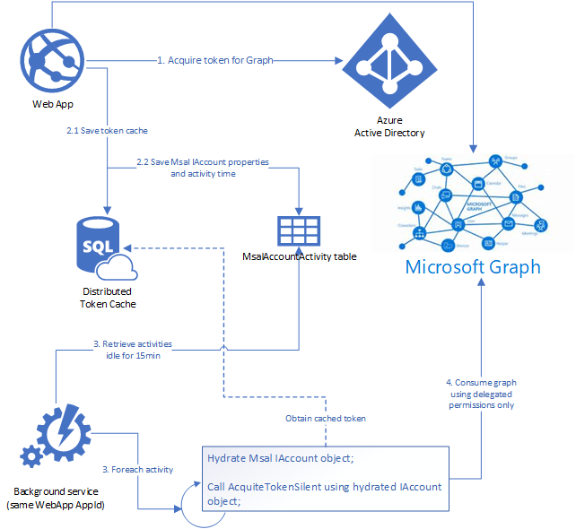

# Share the MSAL token cache between a web app and a background console worker app

## Overview

This sample shows how a web app thats signs-in users can share its cache of tokens for  signed-in users with a background console application, which can continue to act on-behalf of users in their absence

## Scenario

In this sample a .NET Core MVC Web app uses the [MSAL.NET](http://aka.ms/msal-net) and [Microsoft.Identity.Web](https://aka.ms/microsoft-identity-web) libraries to sign-in users, acquire an [Access Token](https://aka.ms/access-tokens) for [Microsoft Graph](https://graph.microsoft.com) and calls the [Microsoft Graph](https://docs.microsoft.com/graph/overview) `/me` endpoint. The [Microsoft.Identity.Web](https://aka.ms/microsoft-identity-web) library is configured to cache the users tokens in a [Sql Server](https://github.com/AzureAD/microsoft-identity-web/wiki/token-cache-serialization) instance. Notably, the Web app only uses [Delegated Permissions](https://docs.microsoft.com/graph/auth/auth-concepts#microsoft-graph-permissions) for its calls to Microsoft Graph.

Another .NET Core console application, which in real world would constitute a background worked of the front-end web app, shares the app ID (ClientId) of the Web App and thus is able to acquire the access tokens cached earlier by the Web App for [Microsoft Graph](https://docs.microsoft.com/graph/overview) using the MSAL library.

This token sharing allows this console application, which doesn't interact or sign-in users itself, to be able to accomplish its objective of working on behalf of the users who signed-in earlier in the Web App.

Additionally, since the console app uses cached tokens with delegated permissions only, it doesn't need to use a flow like [Client Credentials](https://docs.microsoft.com/azure/active-directory/develop/v2-oauth2-client-creds-grant-flow) which will necessitate it requesting high-privilege [Application Permissions](https://docs.microsoft.com/graph/auth/auth-concepts#microsoft-graph-permissions) which often require an [admin consent](https://docs.microsoft.com/azure/active-directory/develop/v2-admin-consent).




## How to run this sample

Pre-requisites:

- If you want to store the token cache on a **SQL Server database**, you can easily generate the token cache table by installing the following tool using the **Developer Command Prompt for Visual Studio** (running as administrator):

```shell
dotnet tool install --global dotnet-sql-cache
```

### Step 1: Navigate to the solution folder in the cloned repository

From your shell or command line:

```console
cd "1-Integrated-Cache\1-1-WebApp-BgWorker"
```

### Step 2: Register the Web App project with your Azure AD tenant

There is two projects in this sample, although you will only use one app registration. To register it, you can:

- either follow the step [Choose the Azure AD tenant where you want to create your applications](#choose-the-azure-ad-tenant-where-you-want-to-create-your-applications) below
- or use PowerShell scripts that:
  - **automatically** creates the Azure AD applications and related objects (passwords, permissions, dependencies) for you.
  - modify the projects' configuration files.

<details>
  <summary>Expand this section if you want to use this automation:</summary>

1. On Windows, run PowerShell and navigate to the root of the cloned directory
1. In PowerShell run:

   ```PowerShell
   Set-ExecutionPolicy -ExecutionPolicy RemoteSigned -Scope Process -Force
   ```

1. Run the script to create your Azure AD application and configure the code of the sample application accordingly.
1. In PowerShell run:

   ```PowerShell
   cd .\AppCreationScripts\
   .\Configure.ps1
   ```

   > Other ways of running the scripts are described in [App Creation Scripts](./AppCreationScripts/AppCreationScripts.md)
   > The scripts also provide a guide to automated application registration, configuration and removal which can help in your CI/CD scenarios.

</details>

Follow the steps below to manually walk through the steps to register and configure the applications in the Azure portal.

### Choose the Azure AD tenant where you want to create your applications

As a first step you'll need to:

1. Sign in to the [Azure portal](https://portal.azure.com).
1. If your account is present in more than one Azure AD tenant, select your profile at the top right corner in the menu on top of the page, and then **switch directory** to change your portal session to the desired Azure AD tenant..

#### Register the webApp app (WebApp-SharedTokenCache)

1. Navigate to the Microsoft identity platform for developers [App registrations](https://go.microsoft.com/fwlink/?linkid=2083908) page.
1. Select **New registration**.
1. In the **Register an application page** that appears, enter your application's registration information:
   - In the **Name** section, enter a meaningful application name that will be displayed to users of the app, for example `WebApp-SharedTokenCache`.
   - Under **Supported account types**, select **Accounts in any organizational directory and personal Microsoft accounts (e.g. Skype, Xbox, Outlook.com)**.
   - In the **Redirect URI (optional)** section, select **Web** in the combo-box and enter the following redirect URI: `https://localhost:44321/signin-oidc`.
1. Select **Register** to create the application.
1. In the app's registration screen, find and note the **Application (client) ID**. You use this value in your app's configuration file(s) later in your code.
1. In the app's registration screen, select **Authentication** in the menu.
   - If you don't have a platform added, select **Add a platform** and select the **Web** option.
   - In the **Logout URL** section, set it to `https://localhost:44321/signout-oidc`.
1. Select **Save** to save your changes.
1. In the app's registration screen, click on the **Certificates & secrets** blade in the left to open the page where we can generate secrets and upload certificates.
1. In the **Client secrets** section, click on **New client secret**:
   - Type a key description (for instance `app secret`),
   - Select one of the available key durations (**In 1 year**, **In 2 years**, or **Never Expires**) as per your security posture.
   - The generated key value will be displayed when you click the **Add** button. Copy the generated value for use in the steps later.
   - You'll need this key later in your code's configuration files. This key value will not be displayed again, and is not retrievable by any other means, so make sure to note it from the Azure portal before navigating to any other screen or blade.
1. In the app's registration screen, click on the **API permissions** blade in the left to open the page where we add access to the APIs that your application needs.
   - Click the **Add a permission** button and then,
   - Ensure that the **Microsoft APIs** tab is selected.
   - In the *Commonly used Microsoft APIs* section, click on **Microsoft Graph**
   - In the **Delegated permissions** section, select the **User.Read** in the list. Use the search box if necessary.
   - Click on the **Add permissions** button at the bottom.

#### Configure the webApp app (WebApp-SharedTokenCache) to use your app registration

Open the project in your IDE (like Visual Studio or Visual Studio Code) to configure the code.

>In the steps below, "ClientID" is the same as "Application ID" or "AppId".

1. Open the `appsettings.json` file for the `WebApp`.
2. Find the app key `ClientId` and replace the existing value with the application ID (clientId) of the `IntegratedWebApp-AdvancedToken` copied from the Azure portal.
3. Find the app key `TenantId` and replace the value with the Tenant ID where you registered your application.
4. Find the app key `Domain` and replace the existing value with your Azure AD tenant name.
5. Find the app key `ClientSecret` and replace the existing value with the key you saved during the creation of the `IntegratedWebApp-AdvancedToken`, in the Azure portal.
6. Find the section `ConnectionStrings` and replace the value of the keys that are relevant to your scenario:
   - If you will use **SQL Server**, update the key `TokenCacheDbConnStr` with the database connection string.
   - If you will use **Redis**, update the key `TokenCacheRedisConnStr` with the Redis connection string, and the key `TokenCacheRedisInstaceName` with the the Redis instance name.

- In case you want to deploy your app in Sovereign or national clouds, ensure the `GraphApiUrl` option matches the one you want. By default this is Microsoft Graph in the Azure public cloud

  ```Json
   "GraphApiUrl": "https://graph.microsoft.com/v1.0"
  ```

### Step 3: Register the Background Worker project with your Azure AD tenant

In order to have the Web App and the Background Worker sharing the same token cache, **they must share the same application ID (clientId)** for Azure AD as well. So for this step, you will set additional configuration to the existing `IntegratedWebApp-AdvancedToken` app registration.

1. Navigate to your `WebApp-SharedTokenCache` [App registration](https://go.microsoft.com/fwlink/?linkid=2083908) page.
2. In the app's registration screen, click on the **Authentication** blade in the left.
3. In the **Authentication** section, click on **Add a platform**:
    - Choose **Mobile and desktop applications**
    - Under **Redirect URIs** select the option, `https://login.microsoftonline.com/common/oauth2/nativeclient`
    - Select **Configure** in the bottom

### Step 3.1: Configure the Background Worker project to use your app registration

Open the project in your IDE (like Visual Studio) to configure the code.
>In the steps below, "ClientID" is the same as "Application ID" or "AppId".

1. Open the `appsettings.json` file for the `BackgroundWorker`.
2. Find the app key `ClientId` and replace the existing value with the application ID (clientId) of the `IntegratedWebApp-AdvancedToken` copied from the Azure portal.
3. Find the app key `TenantId` and replace the value with the Tenant ID where you registered your application.
4. Find the app key `Domain` and replace the existing value with your Azure AD tenant name.
5. Find the app key `ClientSecret` and replace the existing value with the key you saved during the creation of the `IntegratedWebApp-AdvancedToken`, in the Azure portal.
6. Find the section for the `ConnectionStrings` and replace the value of the keys that are relevant to your scenario:
   - If you will use **SQL Server**, update the key `TokenCacheDbConnStr` with the database connection string.
   - If you will use **Redis**, update the key `TokenCacheRedisConnStr` with the Redis connection string, and the key `TokenCacheRedisInstaceName` with the the Redis instance name.

### Storing the token cache on Redis

>NOTE: If you are storing the token cache on SQL Server, you can skip this step.

If you are storing the distributed token cache on Redis, you will need to modify the *BackgroundWorker* `Program.cs` file, and *WebAPI* `Startup.cs` file:

- Open the file `Program.cs`
  - Comment the section named **SQL SERVER CONFIG**
  - Uncomment the section named **REDIS CONFIG**
- Open the file `Startup.cs`
  - Comment the section named **SQL SERVER CONFIG**
  - Uncomment the section named **REDIS CONFIG**

## Step 4: Run the sample

To populate the distributed token cache, and the entity `MsalAccountActivity`, the **WebApp must be executed first**. Open the WebApp on multiple browsers (or using the same browser but in incognito mode) and sign-in with multiple users. **Do not sign-out, otherwise their token cache will be deleted**.

Once you have signed-in with at least 2 users, stop the WebApp project, **without signing them out** and execute the **BackgroundWorker** project.

Once running, the background worker should be returning all account activities that happened more than 30 seconds ago. You can either change the time interval or wait for it.

With all the accounts retrieved, the background worker will print those that got their token acquired successfully and those that failed. To test a failure scenario, you can sign-out one of the users in the WebApp, and execute the background worker again.

## Next steps: Add a Web API in this mix and extend the cache sharing.

In the next tutorial, we will enhance this sample to add a Web API to the mix. This web API uses the [on-behalf of](https://docs.microsoft.com/azure/active-directory/develop/v2-oauth2-on-behalf-of-flow) to call Microsoft Graph on the signed-in user's behalf. 

See [Share the MSAL token cache between a web app , its web API and a background console worker app](../1-2-WebAPI-BgWorker/README.md)

> [Consider taking a moment to share your experience with us.](https://forms.office.com/Pages/ResponsePage.aspx?id=v4j5cvGGr0GRqy180BHbR73pcsbpbxNJuZCMKN0lURpUM0FERTFGTjlKVUVWTzNINjdMTkFWTE43UiQlQCN0PWcu)

## About The code

### IntegratedCacheUtils project

[Please refer to this page to learn more about the IntegratedCacheUtils project.](../IntegratedCacheUtilsReadme.md)

### Web App project

In the Web App project, we leverage [`Microsoft.Identity.Web`](https://github.com/AzureAD/microsoft-authentication-library-for-dotnet/wiki) to configure the authorization code flow and access token acquisition, and use
the `IntegratedTokenCacheAdapter.cs` as an extension for the `MsalDistributedTokenCacheAdapter`, so that before MSAL writes a token cache, we hydrate and save the `MsalAccountActivity.cs` entity.

```c#
services.AddAuthentication(OpenIdConnectDefaults.AuthenticationScheme)
    .AddMicrosoftWebApp(Configuration)
    .AddMicrosoftWebAppCallsWebApi(Configuration, new string[] { Constants.ScopeUserRead })
    .AddIntegratedUserTokenCache();
```

To store the distributed token cache, you could use SQL Server or Redis for instance:

SQL Server, leveraging `Microsoft.Extensions.Caching.Sql` NuGet package:

```c#
services.AddDistributedSqlServerCache(options =>
{
    /*
        To create the token cache table:
        dotnet tool install --global dotnet-sql-cache
        dotnet sql-cache create "<YourDatabaseConnectionString>" dbo <TokenCacheTableName>    
    */
    options.ConnectionString = Configuration.GetConnectionString("TokenCacheDbConnStr");
    options.SchemaName = "dbo";
    options.TableName = "<TokenCacheTableName>";
});
```

Redis, leveraging `Microsoft.Extensions.Caching.StackExchangeRedis` NuGet package:

```c#
services.AddStackExchangeRedisCache(options =>
{
    options.Configuration = Configuration.GetConnectionString("TokenCacheRedisConnStr");
    options.InstanceName = Configuration.GetConnectionString("TokenCacheRedisInstaceName");
});
```
And setup the Dependency Injection for the desired `IMsalAccountActivityStore` implementation. For instance:

Save `MsalAccountActivity.cs` entity on SQL Server: 
```c#
services.AddDbContext<IntegratedTokenCacheDbContext>(options =>
    options.UseSqlServer(Configuration.GetConnectionString("TokenCacheDbConnStr")));
services.AddScoped<IIntegratedTokenCacheStore, IntegratedSqlServerTokenCacheStore>();
```

### BackgroundWorker project

[Please refer to this page to learn more about the BackgroundWorker project.](../BackgroundWorker.md)

## Learn more

- Learn about [Microsoft.Identity.Web](https://github.com/AzureAD/microsoft-identity-web/wiki)
- Learn how to enable distributed caches in [token cache serialization](https://github.com/AzureAD/microsoft-identity-web/wiki/token-cache-serialization)
- [Use HttpClientFactory to implement resilient HTTP requests](https://docs.microsoft.com/en-us/dotnet/standard/microservices-architecture/implement-resilient-applications/use-httpclientfactory-to-implement-resilient-http-requests) used by the Graph custom service
