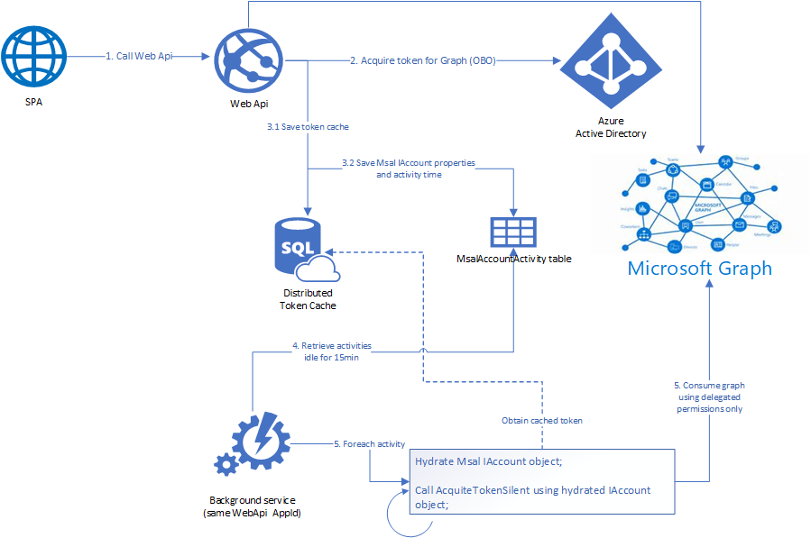

# Using an integrated token cache between a web api and a background worker

## Scenario

A .NET Core Web Api protected by [Azure AD](https://azure.microsoft.com/services/active-directory/), that calls [MS Graph API](https://developer.microsoft.com/graph) on behalf of the user, using the [on-behalf-of flow](https://docs.microsoft.com/azure/active-directory/develop/v2-oauth2-on-behalf-of-flow). It leverages the Microsoft Authentication Library [MSAL.NET](https://github.com/AzureAD/microsoft-authentication-library-for-dotnet) to acquire an [access token](https://docs.microsoft.com/azure/active-directory/develop/access-tokens) for Graph, and the NuGet package [`Microsoft.Identity.Web`](https://github.com/AzureAD/microsoft-authentication-library-for-dotnet/wiki) to configure a distributed token cache.

Then, a .NET Core console application that shares the same ClientId with the Web Api, and can acquire a token for [Microsoft Graph](https://docs.microsoft.com/graph/overview) silently, using the access token cached from the Web Api. Although this console application doesn't have user interactions, it doesn't not require *Application Permissions* to call [Microsoft Graph](https://docs.microsoft.com/graph/overview).



## How to run this sample

Pre-requisites:

- If you want to store the token cache on a **SQL Server database**, you can easily generate the token cache table by installing the following tool using the **Developer Command Prompt for Visual Studio** (running as administrator): 
    ```shell
    dotnet tool install --global dotnet-sql-cache
    ```
- If you don't have a SQL Server database to be used in this sample yet, [please create one](https://docs.microsoft.com//sql/relational-databases/databases/create-a-database?view=sql-server-ver15). You can name it as you wish.   

## Step 1: Clone the repository

From your shell or command line:

```console
git clone https://github.com/Azure-Samples/ms-identity-dotnet-advanced-token-cache.git
```

or download and extract the repository .zip file.

> :warning: Given that the name of the sample is quiet long, and so are the names of the referenced packages, you might want to clone it in a folder close to the root of your hard drive, to avoid file size limitations on Windows.

## Step 2: App Registration

There are two projects in this sample. Each needs to be separately registered in your Azure AD tenant. To register these projects, you can:

- either follow the step [Choose the Azure AD tenant where you want to create your applications](#choose-the-azure-ad-tenant-where-you-want-to-create-your-applications) below
- or use PowerShell scripts that:
  - **automatically** creates the Azure AD applications and related objects (passwords, permissions, dependencies) for you.
  - modify the projects' configuration files.

<details>
  <summary>Expand this section if you want to use this automation:</summary>

1. On Windows, run PowerShell and navigate to the root of the cloned directory
1. In PowerShell run:

   ```PowerShell
   Set-ExecutionPolicy -ExecutionPolicy RemoteSigned -Scope Process -Force
   ```

1. Run the script to create your Azure AD application and configure the code of the sample application accordingly.
1. In PowerShell run:

   ```PowerShell
   cd .\AppCreationScripts\
   .\Configure.ps1
   ```

   > Other ways of running the scripts are described in [App Creation Scripts](./AppCreationScripts/AppCreationScripts.md)
   > The scripts also provide a guide to automated application registration, configuration and removal which can help in your CI/CD scenarios.

</details>

Follow the steps below to manually register and configure your application on Azure AD.

### Choose the Azure AD tenant where you want to create your applications

As a first step you'll need to:

1. Sign in to the [Azure portal](https://portal.azure.com).
1. If your account is present in more than one Azure AD tenant, select your profile at the top right corner in the menu on top of the page, and then **switch directory**.

### Step 2.1: Register the service app (IntegratedWebApi-AdvancedToken)

1. Navigate to the Microsoft identity platform for developers [App registrations](https://go.microsoft.com/fwlink/?linkid=2083908) page.
1. Select **New registration**.
1. In the **Register an application page** that appears, enter your application's registration information:
   - In the **Name** section, enter a meaningful application name that will be displayed to users of the app, for example `IntegratedWebApi-AdvancedToken`.
   - Under **Supported account types**, select **Accounts in this organizational directory only**.
1. Select **Register** to create the application.
1. In the app's registration screen, find and note the **Application (client) ID**. You use this value in your app's configuration file(s) later in your code.
1. Select **Save** to save your changes.
1. In the app's registration screen, click on the **Certificates & secrets** blade in the left to open the page where we can generate secrets and upload certificates.
1. In the **Client secrets** section, click on **New client secret**:
   - Type a key description (for instance `app secret`),
   - Select one of the available key durations (**In 1 year**, **In 2 years**, or **Never Expires**) as per your security concerns.
   - The generated key value will be displayed when you click the **Add** button. Copy the generated value for use in the steps later.
   - You'll need this key later in your code's configuration files. This key value will not be displayed again, and is not retrievable by any other means, so make sure to note it from the Azure portal before navigating to any other screen or blade.
1. In the app's registration screen, click on the **API permissions** blade in the left to open the page where we add access to the Apis that your application needs.
   - Click the **Add a permission** button and then,
   - Ensure that the **Microsoft APIs** tab is selected.
   - In the *Commonly used Microsoft APIs* section, click on **Microsoft Graph**
   - In the **Delegated permissions** section, select the **User.Read** in the list. Use the search box if necessary.
   - Click on the **Add permissions** button at the bottom.
1. In the app's registration screen, select the **Expose an API** blade to the left to open the page where you can declare the parameters to expose this app as an Api for which client applications can obtain [access tokens](https://docs.microsoft.com/azure/active-directory/develop/access-tokens) for.
The first thing that we need to do is to declare the unique [resource](https://docs.microsoft.com/azure/active-directory/develop/v2-oauth2-auth-code-flow) URI that the clients will be using to obtain access tokens for this Api. To declare an resource URI, follow the following steps:
   - Click `Set` next to the **Application ID URI** to generate a URI that is unique for this app.
   - For this sample, accept the proposed Application ID URI (api://{clientId}) by selecting **Save**.
1. All Apis have to publish a minimum of one [scope](https://docs.microsoft.com/azure/active-directory/develop/v2-oauth2-auth-code-flow#request-an-authorization-code) for the client's to obtain an access token successfully. To publish a scope, follow the following steps:
   - Select **Add a scope** button open the **Add a scope** screen and Enter the values as indicated below:
        - For **Scope name**, use `access_as_user`.
        - Select **Admins and users** options for **Who can consent?**
        - For **Admin consent display name** type `Access IntegratedWebApi-AdvancedToken`
        - For **Admin consent description** type `Allows the app to access IntegratedWebApi-AdvancedToken as the signed-in user.`
        - For **User consent display name** type `Access IntegratedWebApi-AdvancedToken`
        - For **User consent description** type `Allow the application to access IntegratedWebApi-AdvancedToken on your behalf.`
        - Keep **State** as **Enabled**
        - Click on the **Add scope** button on the bottom to save this scope.

#### Configure the service app (IntegratedWebApi-AdvancedToken) to use your app registration

Open the project in your IDE to configure the code.

> In the steps below, "ClientID" is the same as "Application ID" or "AppId".

1. Open the `WebAPI\appsettings.json` file
1. Find the app key `Domain` and replace the existing value with your Azure AD tenant name.

1. Find the app key `TenantId` and replace the existing value with your Azure AD tenant ID.

1. Find the app key `ClientId` and replace the existing value with the application ID (clientId) of the `IntegratedWebApi-AdvancedToken` application copied from the Azure portal.

1. Find the app key `ClientSecret` and replace the existing value with the key you saved during the creation of the `IntegratedWebApi-AdvancedToken` app, in the Azure portal.

### Step 2.2: Register the client app (ProfileSPA-AdvancedToken)

1. Navigate to the Microsoft identity platform for developers [App registrations](https://go.microsoft.com/fwlink/?linkid=2083908) page.
1. Select **New registration**.
1. In the **Register an application page** that appears, enter your application's registration information:
   - In the **Name** section, enter a meaningful application name that will be displayed to users of the app, for example `ProfileSPA-AdvancedToken`.
   - Under **Supported account types**, select **Accounts in this organizational directory only**.
   - In the **Redirect URI (optional)** section, select **Single-Page Application** in the combo-box and enter the following redirect URI: `http://localhost:3000`.
1. Select **Register** to create the application.
1. In the app's registration screen, find and note the **Application (client) ID**. You use this value in your app's configuration file(s) later in your code.
1. Select **Save** to save your changes.
1. In the app's registration screen, click on the **API permissions** blade in the left to open the page where we add access to the Apis that your application needs.
   - Click the **Add a permission** button and then:

   - Ensure that the **Microsoft APIs** tab is selected.
   - In the *Commonly used Microsoft APIs* section, click on **Microsoft Graph**
   - In the **Delegated permissions** section, select the **User.Read** in the list. Use the search box if necessary.
   - Click on the **Add permissions** button at the bottom.
   - Click the **Add a permission** button and then:

   - Ensure that the **My APIs** tab is selected.
   - In the list of APIs, select the API `IntegratedWebApi-AdvancedToken`.
   - In the **Delegated permissions** section, select the **Access 'IntegratedWebApi-AdvancedToken'** in the list. Use the search box if necessary.
   - Click on the **Add permissions** button at the bottom.

#### Configure the client app (ProfileSPA-AdvancedToken) to use your app registration

Open the project in your IDE to configure the code.

> In the steps below, "ClientID" is the same as "Application ID" or "AppId".

1. Open the `SPA\src\utils\authConfig.js` file
1. Find the app key `Enter the Client Id (aka 'Application ID')` and replace the existing value with the application ID (clientId) of the `ProfileSPA-AdvancedToken` application copied from the Azure portal.

1. Find the app key `Enter the Authority, e.g 'https://login.microsoftonline.com/{tid}'` and replace the existing value with ('https://login.microsoftonline.com/'+ $tenantId).

1. Find the app key `Enter the API scopes as declared in the app registration 'Expose an Api' blade in the form of 'api://{client_id}/.default'` and replace the existing value with ScopeDefault.

1. Find the app key `Enter the WebAPI URI, e.g. 'https://localhost:44351/api/profile'` and replace the existing value with the base address of the IntegratedWebApi-AdvancedToken project (by default `https://localhost:44351/api/profile`).


#### Configure Known Client Applications for service (IntegratedWebApi-AdvancedToken)

For a middle tier Web API (`IntegratedWebApi-AdvancedToken`) to be able to call a downstream Web API, the middle tier app needs to be granted the required permissions as well.
However, since the middle tier cannot interact with the signed-in user, it needs to be explicitly bound to the client app in its Azure AD registration.
This binding merges the permissions required by both the client and the middle tier Web Api and presents it to the end user in a single consent dialog. The user then consent to this combined set of permissions.

To achieve this, you need to add the **Application Id** of the client app, in the Manifest of the Web API in the `knownClientApplications` property. Here's how:

1. In the [Azure portal](https://portal.azure.com), navigate to your `IntegratedWebApi-AdvancedToken` app registration, and select **Manifest** section.
1. In the manifest editor, change the `"knownClientApplications": []` line so that the array contains 
   the Client ID of the client application (`ProfileSPA-AdvancedToken`) as an element of the array.

    For instance:

    ```json
    "knownClientApplications": ["ca8dca8d-f828-4f08-82f5-325e1a1c6428"],
    ```

1. **Save** the changes to the manifest.

## Step 3: Register the Background Worker project with your Azure AD tenant

In order to have the Web App and the Background Worker sharing the same token cache, **they must share the same application ID (clientId)** on Azure AD as well. So for this step, you will set additional configuration to the existing `IntegratedWebApi-AdvancedToken` app registration.

1. Navigate to your `IntegratedWebApi-AdvancedToken` [App registration](https://go.microsoft.com/fwlink/?linkid=2083908) page.
2. In the app's registration screen, click on the **Authentication** blade in the left.
3. In the **Authentication** section, click on **Add a platform**:
    - Choose **Mobile and desktop applications**
    - Under **Redirect URIs** select the option, `https://login.microsoftonline.com/common/oauth2/nativeclient`
    - Select **Configure** in the bottom

### Step 3.1: Configure the Background Worker project to use your app registration

Open the project in your IDE (like Visual Studio) to configure the code.
>In the steps below, "ClientID" is the same as "Application ID" or "AppId".

1. Open the `appsettings.json` file for the `BackgroundWorker`.
2. Find the app key `ClientId` and replace the existing value with the application ID (clientId) of the `IntegratedWebApi-AdvancedToken` copied from the Azure portal.
3. Find the app key `TenantId` and replace the value with the Tenant ID where you registered your application.
4. Find the app key `Domain` and replace the existing value with your Azure AD tenant name.
5. Find the app key `ClientSecret` and replace the existing value with the key you saved during the creation of the `IntegratedWebApi-AdvancedToken`, in the Azure portal.
6. Find the section for the `ConnectionStrings` and replace the value of the keys that are relevant to your scenario:
   - If you will use **SQL Server**, update the key `TokenCacheDbConnStr` with the database connection string.
   - If you will use **Redis**, update the key `TokenCacheRedisConnStr` with the Redis connection string, and the key `TokenCacheRedisInstaceName` with the the Redis instance name.

## Step 4: Configure the SQL Server database

>Note: You just need to apply the Entity Framework migrations once, when you are running the sample for the very first time.

This sample uses a SQL Server to store the entity `MsalAccountActivity`, and by using [Entity Framework migrations](https://docs.microsoft.com/ef/core/managing-schemas/migrations/?tabs=dotnet-core-cli), you can create the entity table scheme in your database with few steps:

1. On Visual Studio, open the **Package Manager Console** tab.
2. On the **Default Project** dropdown, select `IntegratedCacheUtils`.
3. On the console, execute the command `Update-Database`. 

If your solution is building without errors and you have setup the database connection string, this script will create the table `MsalAccountActivities`. If you are not using Visual Studio, please [check how to apply Entity Framework migrations via CLI](https://docs.microsoft.com/ef/core/managing-schemas/migrations/applying?tabs=dotnet-core-cli).

### Storing the token cache on the SQL Server database

>NOTE: If you are storing the token cache on Redis, you can skip this step.

If you want to store the token cache on your database as well, you must create the the token cache table before. To do so, open the **Developer Command Prompt for Visual Studio** (running as administrator) and run the following script, replacing the connection string value with your own:

```shell
dotnet sql-cache create "Data Source=<Your-DB-connection-string>" dbo <table-name-to-be-created>
```

Example:

```shell
dotnet sql-cache create "Data Source=(localdb)\MSSQLLocalDB;Initial Catalog=MsalTokenCacheDatabase;Integrated Security=True;" dbo TokenCache
```

## Step 5: Run the sample

To populate the distributed token cache, and the entity `MsalAccountActivity`, the **SPA and WebApi must be executed first**. 

### Step 5.1: Run WebApi project

Run the **WebApi** project.

When you start the Web API from Visual Studio, depending on the browser you use, you'll get:

- an empty web page (case with Microsoft Edge)
- or an error HTTP 401 (case with Chrome)

This behavior is expected as you are not authenticated and the WebApi doesn't have a landing page.

### Step 5.2: Run and Install SPA dependencies

Using a command line interface such as VS Code integrated terminal, locate the application directory and execute the following command: 

```console
cd ../
cd SPA
npm install
```

Once `npm install` is completed, you can run the SPA with the command:

```console
npm start
```

Open the SPA on multiple browser tabs (you might want to open the tabs in incognito) and sign-in with multiple users.

Once you have signed-in with at least 2 users you can stop both SPA and WebAPI projects, and execute the BackgroundWorker project.

The background worker is returning all account activities that happened more than 1 minutes ago. You could either change the time interval or wait for it. 

With all the accounts retrieved, the background worker will print those that got their token acquired successfully and those that failed. To test a failure scenario, you can for instance, delete one of the users token cache and execute the background worker again. 

## About The code

### IntegratedCacheUtils project

[Please refer to this page to learn more about the IntegratedCacheUtils project.](../IntegratedCacheUtilsReadme.md)

### SPA and Web Api project

In the Web Api project, we leverage [`Microsoft.Identity.Web`](https://github.com/AzureAD/microsoft-authentication-library-for-dotnet/wiki) to configure the bearer authentication and on-behalf-of flow(OBO), and use 
the `IntegratedTokenCacheAdapter.cs` as an extension for the `MsalDistributedTokenCacheAdapter`, so that before MSAL writes a token cache, we hydrate and save the `MsalAccountActivity.cs` entity. 

```c#
services.AddAuthentication(JwtBearerDefaults.AuthenticationScheme)
    .AddMicrosoftWebApi(Configuration)
    .AddMicrosoftWebApiCallsWebApi(Configuration)
    .AddIntegratedUserTokenCache();

To store the distributed token cache, you could use SQL Server or Redis for instance:

SQL Server, leveraging `Microsoft.Extensions.Caching.Sql` NuGet package:

```c#
services.AddDistributedSqlServerCache(options =>
{
    /*
        To create the token cache table:
        dotnet tool install --global dotnet-sql-cache
        dotnet sql-cache create "<YourDatabaseConnectionString>" dbo <TokenCacheTableName>    
    */
    options.ConnectionString = Configuration.GetConnectionString("TokenCacheDbConnStr");
    options.SchemaName = "dbo";
    options.TableName = "<TokenCacheTableName>";
});
```

Redis, leveraging `Microsoft.Extensions.Caching.StackExchangeRedis` NuGet package:

```c#
services.AddStackExchangeRedisCache(options =>
{
    options.Configuration = Configuration.GetConnectionString("TokenCacheRedisConnStr");
    options.InstanceName = Configuration.GetConnectionString("TokenCacheRedisInstaceName");
});
```
And setup the Dependency Injection for the desired `IMsalAccountActivityStore` implementation. For instance:

Save `MsalAccountActivity.cs` entity on SQL Server: 
```c#
services.AddDbContext<IntegratedTokenCacheDbContext>(options =>
    options.UseSqlServer(Configuration.GetConnectionString("TokenCacheDbConnStr")));
services.AddScoped<IIntegratedTokenCacheStore, IntegratedSqlServerTokenCacheStore>();
```

### BackgroundWorker project

[Please refer to this page to learn more about the BackgroundWorker project.](../BackgroundWorker.md)

## Learn more

- Learn about [Microsoft.Identity.Web](https://github.com/AzureAD/microsoft-identity-web/wiki)
- Learn how to enable distributed caches in [token cache serialization](https://github.com/AzureAD/microsoft-identity-web/wiki/token-cache-serialization)
- [Use HttpClientFactory to implement resilient HTTP requests](https://docs.microsoft.com/en-us/dotnet/standard/microservices-architecture/implement-resilient-applications/use-httpclientfactory-to-implement-resilient-http-requests) used by the Graph custom service
